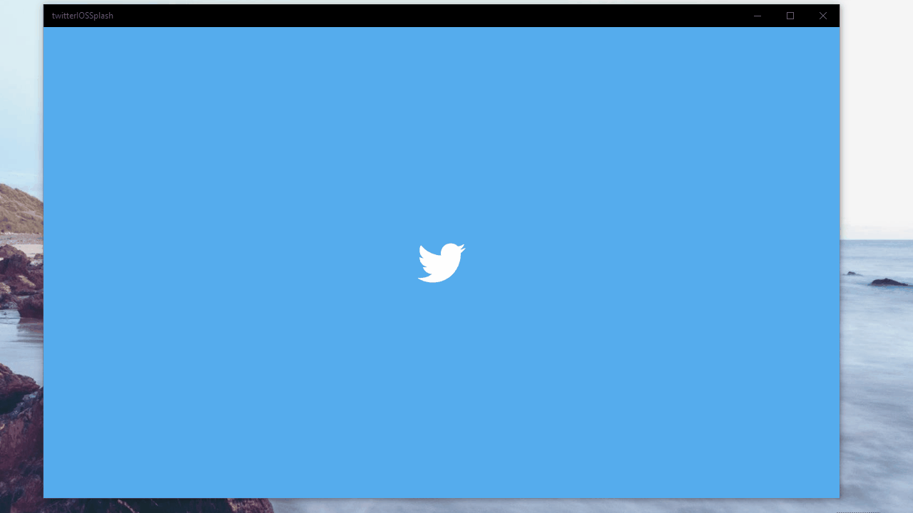

# UWP-Twitter-iOS-Splash-Screen-Recreation
Shows how to get the same splash screen animation as the Twitter iOS app in your app!

## Summary:
1. App starts, blue background with twitter logo as splash screen
2. App moves on to extended splash screen, keeping the same assets with the splash screen
3. When app "finishes loading" (Delay was added to simulate loading time), a scale animation is applied to the splash screen image, zooming into the twitter logo.
4. App then navigates to a new page.
